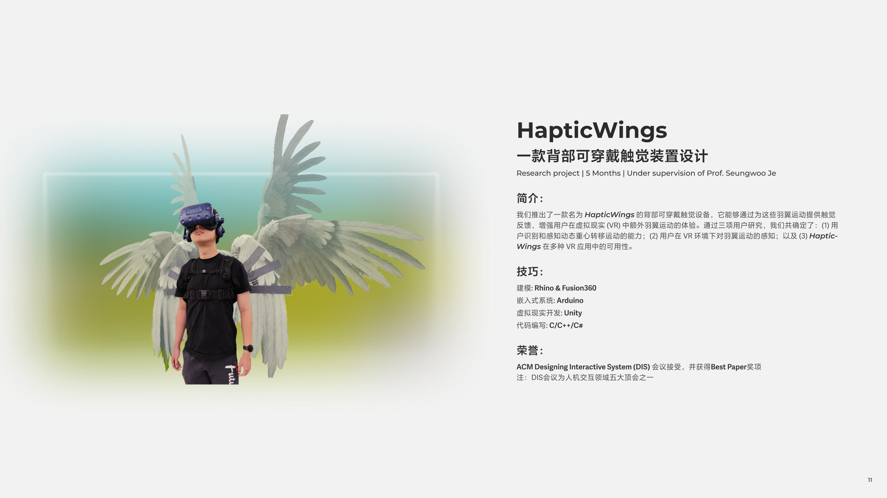
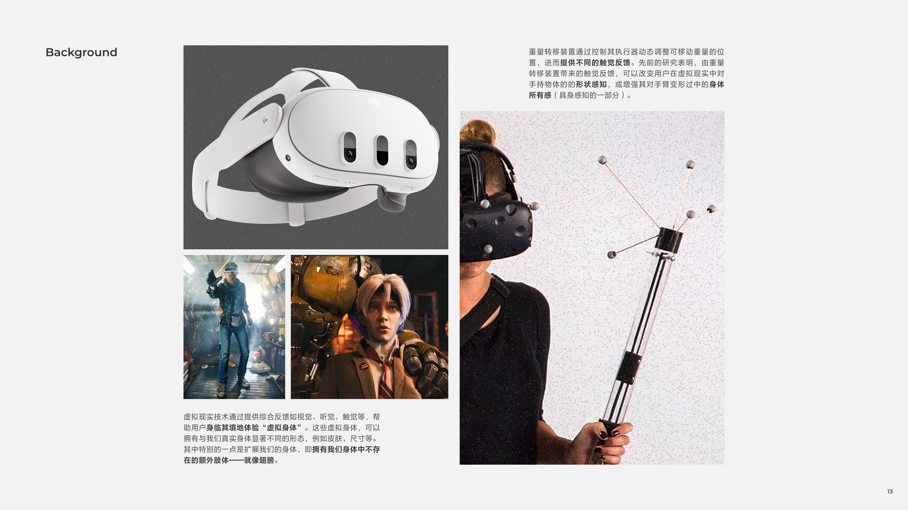
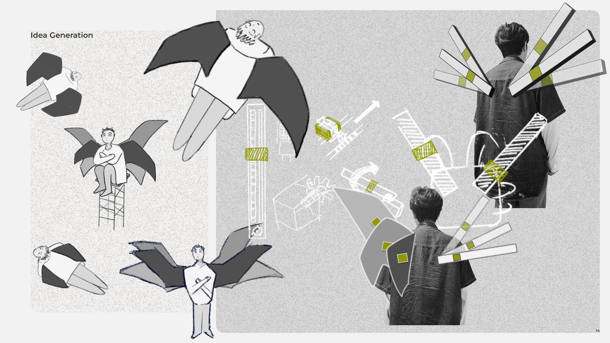
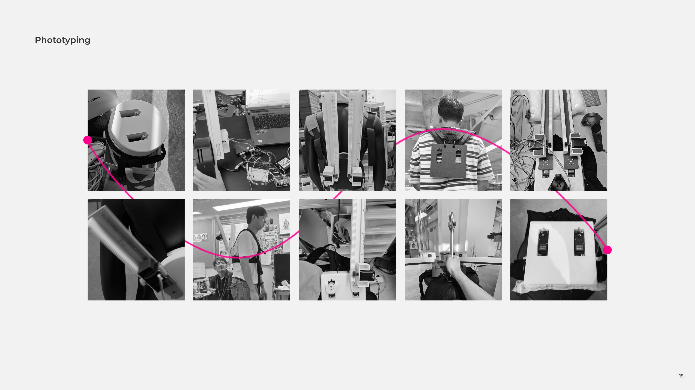
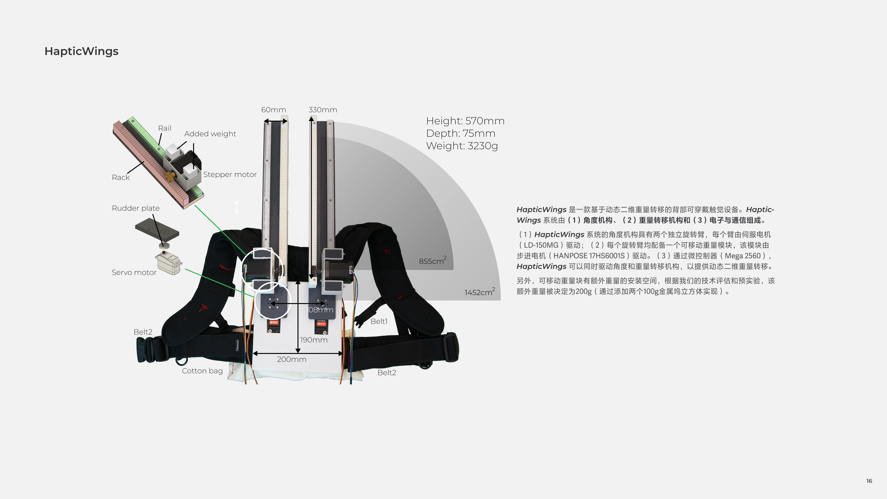
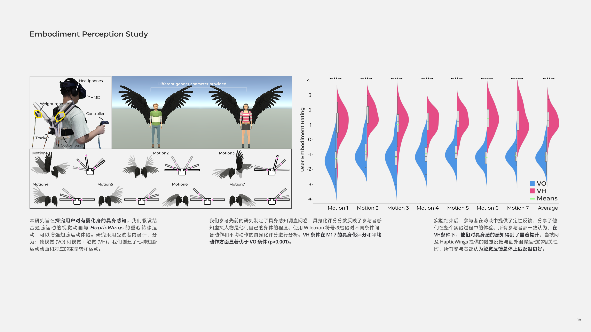
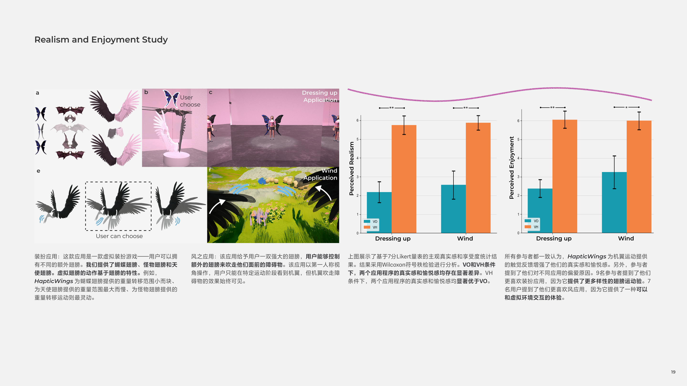
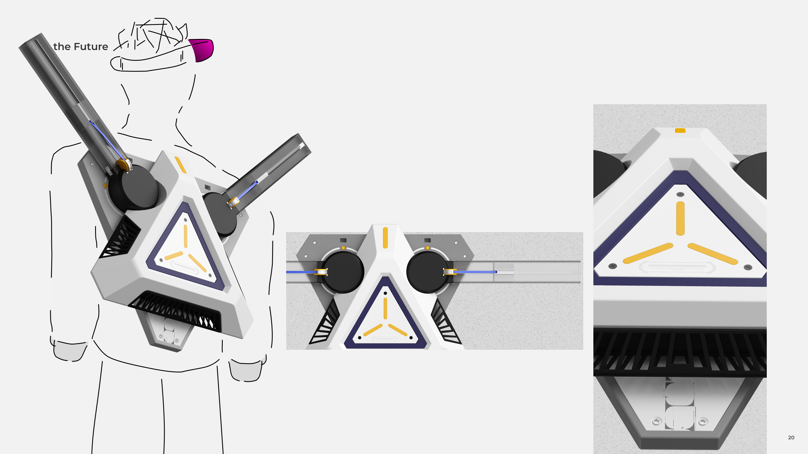

Hello everyone, I'd like to introduce the HapticWings project. This project is **a company-supported project.** A Korean company, MIMETICS, collaborated with our group, the Immersive Design Group in the School of Design at SUSTech. In this project, I mainly focus on **product and structure design.** 

Currently, I have compiled some images, and I will add explanations in the future.

## Research

<small class="block text-center">We created the mood board and conducted an interview that focused on the target users' needs.</small>

## Design

<small class="block text-center">Here I show part of my sketches, and during the design process, we positively used 3D printing for real testing.</small>

## Renderings

<small class="block text-center">Here I show part of my renderings.</small>

## Prototyping

<small class="block text-center">There are some details of our prototype.</small>

## Finally

<small class="block text-center">This is our final prototype. It works well. Thanks to my friends for letting me take such nice pictures of their usage process.</small>

